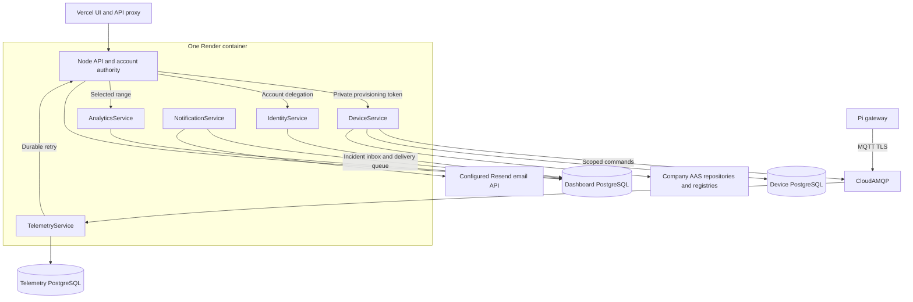

# Backend architecture

The dashboard Node API and five .NET services share one non-root, supervised Render container. The static React UI is on Vercel. Only the Node API is public; internal service traffic uses loopback and scoped service tokens. Databases, Redis, CloudAMQP and the company AAS runtime remain managed external systems. Physical gateways and firmware remain on the OT network.

Telemetry validates bounded payloads, persists before MQTT acknowledgment, preserves named asset signals and missing values, and retries authenticated dashboard delivery from its PostgreSQL outbox. Stable ingestion IDs and database locks prevent retries from inflating dashboard readings or incidents. Analytics reads the dashboard database directly, so no duplicate AMQP telemetry event is published. Pi command IDs are reserved durably before opening the USB serial port to prevent repeated motion after ambiguous failures. This is an operational control path; it does not replace safety-rated machine interlocks.

Identity uses current dashboard accounts and roles. Analytics computes range-bounded SQL coverage and gaps; it does not apply a second conflicting set of example thresholds or invent OEE/RUL. Incident thresholds and downtime confirmation remain in Node. Notifications consume the PostgreSQL inbox generated transactionally by incident writes; Resend failures remain visible and retryable. Email is at least once and provider acceptance is distinct from delivery.

Production requires verified PostgreSQL TLS, Redis TLS, CloudAMQP MQTT TLS, private AAS OAuth and scoped credentials. Render runs one instance with a disk to prevent overlapping stable MQTT client IDs. Only confirmed operational downtime is displayed as factory downtime. See the canonical [deployment and release guide](https://github.com/DruHustle/smart-factory-iot/blob/main/RENDER_DEPLOYMENT.md) and dashboard [architecture](https://github.com/DruHustle/smart-factory-iot/blob/main/docs/architecture.md) for full cross-repository data ownership and topology.
